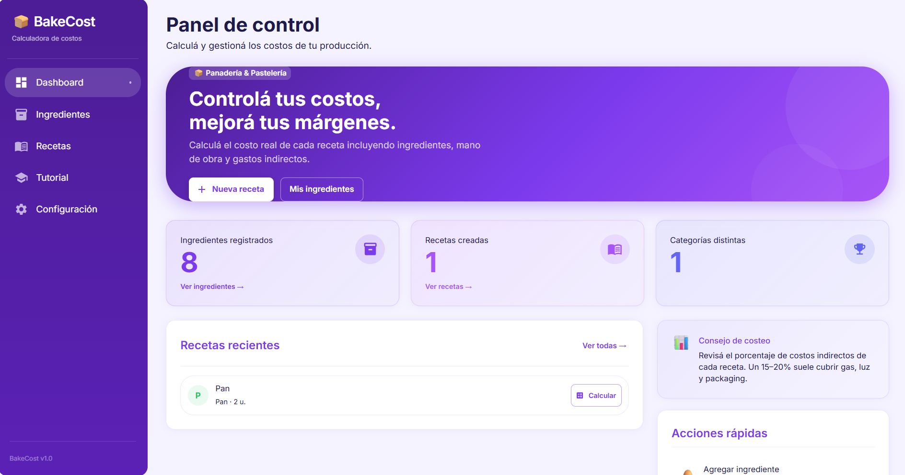
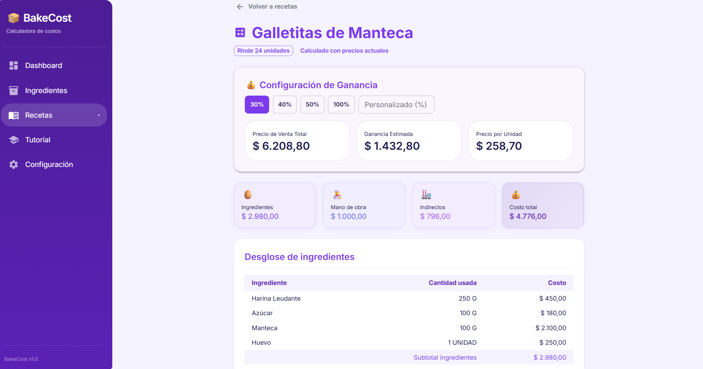
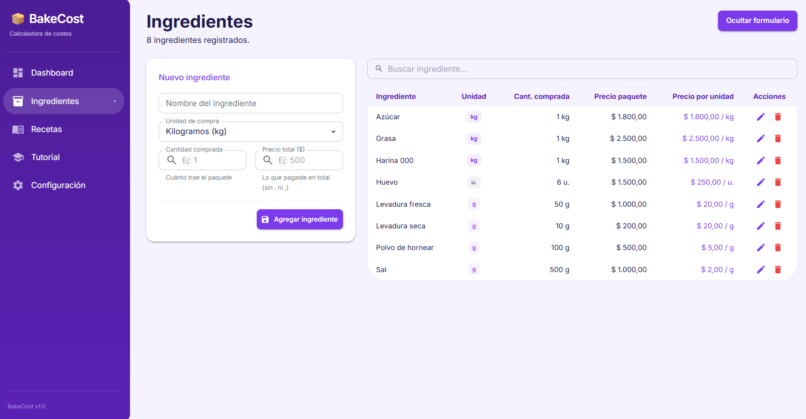
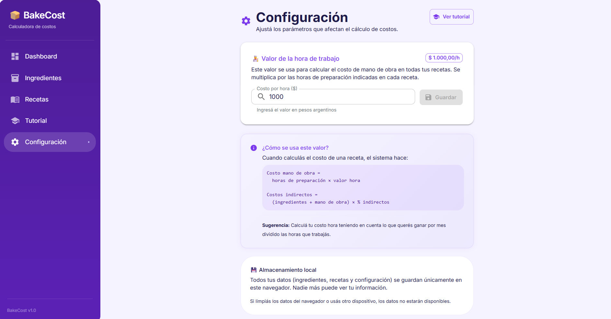
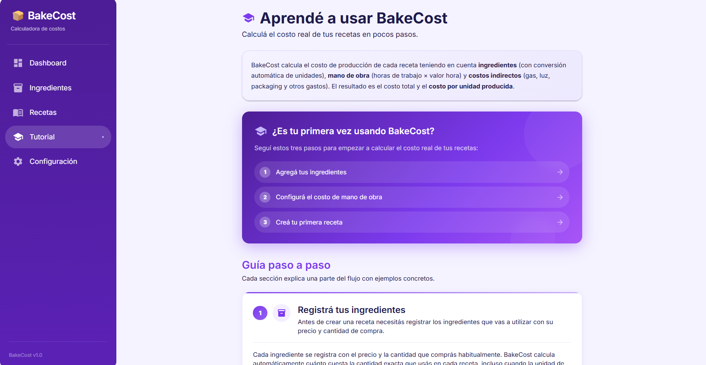

# BakeCost

## Descripción

BakeCost permite a productores de panadería y pastelería calcular el costo real de cada receta, incluyendo ingredientes, mano de obra y costos indirectos (gas, luz, packaging, etc.). El resultado es un desglose detallado con el **costo por unidad producida**, que sirve como base para definir precios de venta.

La aplicación funciona **sin necesidad de crear una cuenta**. Los datos se guardan en el navegador del usuario mediante `localStorage`, lo que permite usarla de inmediato desde cualquier dispositivo sin registro.

## Demo

[Probar BakeCost](https://bakecost-teal.vercel.app/)

> Aplicación desplegada en Vercel  
> Backend desplegado en Render  
> Base de datos PostgreSQL en Neon

## Tecnologías utilizadas

- Frontend: React 19, Vite 8, Material UI 9
- Backend: Spring Boot 4, Java 21
- Base de datos: PostgreSQL
- Testing frontend: Vitest
- Testing backend: JUnit 5 + AssertJ

---

## Arquitectura general

```
[Navegador]
    │
    ├── React (UI)
    │       │
    │       ├── localStorage  ← ingredientes, recetas, configuración
    │       │
    │       └── POST /api/costs/calculate  ← cálculo con precisión BigDecimal
    │
[Spring Boot]
    │
    └── CostCalculationService  ← lógica stateless de cálculo
```

El frontend almacena todos los datos del usuario localmente en el navegador. El backend expone un endpoint stateless para el cálculo de costos, aprovechando la precisión monetaria de `BigDecimal` en Java. Los datos son privados al dispositivo/navegador de cada persona.

---

## Instalación y ejecución

### Requisitos previos

- Node.js 18+
- Java 21
- Maven 3.9+
- PostgreSQL 15+ (solo necesario para levantar el backend localmente)

### Frontend

```bash
cd bakecost-frontend
cp .env.example .env        # ajustar VITE_API_URL si hace falta
npm install
npm run dev                 # http://localhost:5173
```

### Backend

```bash
cd bakecost-backend
cp .env.example .env        # completar credenciales de BD
# Asegurarse de que PostgreSQL esté corriendo con la BD 'bakecost_dev'
./mvnw spring-boot:run      # http://localhost:8080
```

> El frontend funciona sin el backend — los cálculos se hacen localmente en el navegador. El backend es opcional y solo agrega precisión `BigDecimal` al cálculo.

---

## Estructura del proyecto

```
bakecost-app/
├── bakecost-frontend/          # Aplicación React
│   ├── src/
│   │   ├── components/         # Componentes reutilizables (Layout, formularios)
│   │   ├── hooks/              # Hooks personalizados
│   │   ├── pages/              # Una página por ruta
│   │   ├── routes/             # Definición de rutas con React Router
│   │   ├── services/           # Lógica de negocio y acceso a datos
│   │   │   ├── storage/        # CRUD sobre localStorage
│   │   │   └── costCalculator.js  # Lógica de cálculo local
│   │   └── theme.js            # Tema MUI (paleta violeta)
│   └── .env.example
│
└── bakecost-backend/           # API REST Spring Boot
    └── src/main/java/com/bakecost/
        ├── cost/               # Endpoint stateless de cálculo
        ├── ingredient/         # Conversión de unidades
        ├── recipe/             # Lógica de recetas
        ├── settings/           # Configuración
        └── shared/             # CORS, manejo de excepciones
```

---

## Funcionalidades

- **Ingredientes**: registrar con precio y cantidad de compra, editar, eliminar, buscar.
- **Recetas**: crear con múltiples ingredientes, rendimiento, tiempo de preparación y costos indirectos.
- **Cálculo de costos**: desglose completo — ingredientes, mano de obra, costos indirectos, total y costo por unidad.
- **Conversión de unidades**: comprar en KG y usar en G, comprar en L y usar en ML — conversión automática.
- **Configuración**: valor de la hora de trabajo, persiste entre sesiones.
- **Tutorial**: guía paso a paso integrada en la aplicación.
- **Página 404**: manejo amigable de rutas inexistentes.
- **Responsive**: funciona en desktop, tablet y mobile.

---

## Preview

### Dashboard

<p align="center">
  
</p>

### Cálculo de Recetas

<p align="center">
  
</p>

### Gestión de Ingredientes

<p align="center">
  
</p>

### Configuración

<p align="center">
  
</p>

### Tutorial

<p align="center">
  
</p>

## Autor

- Abril Ruiz
- [Email](mailto:abrilvalentinaruiz516@gmail.com)
